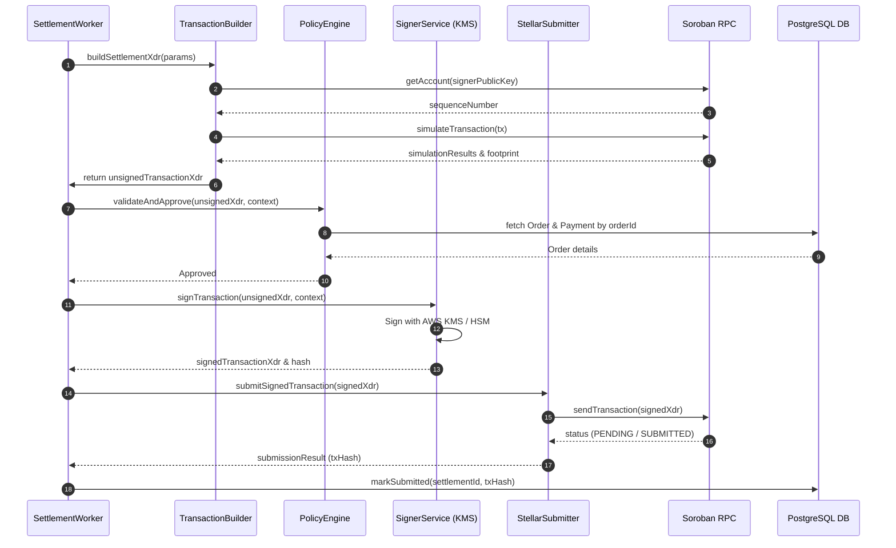
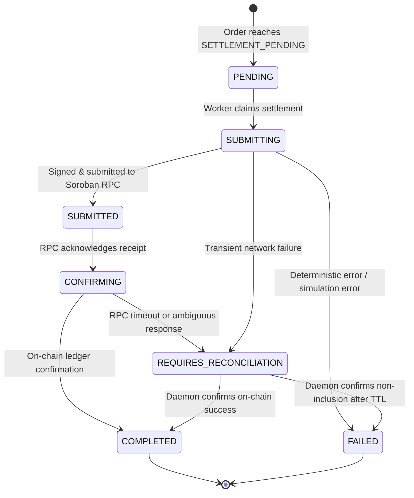
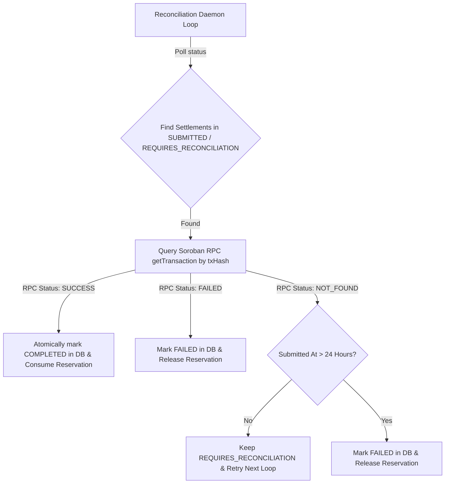
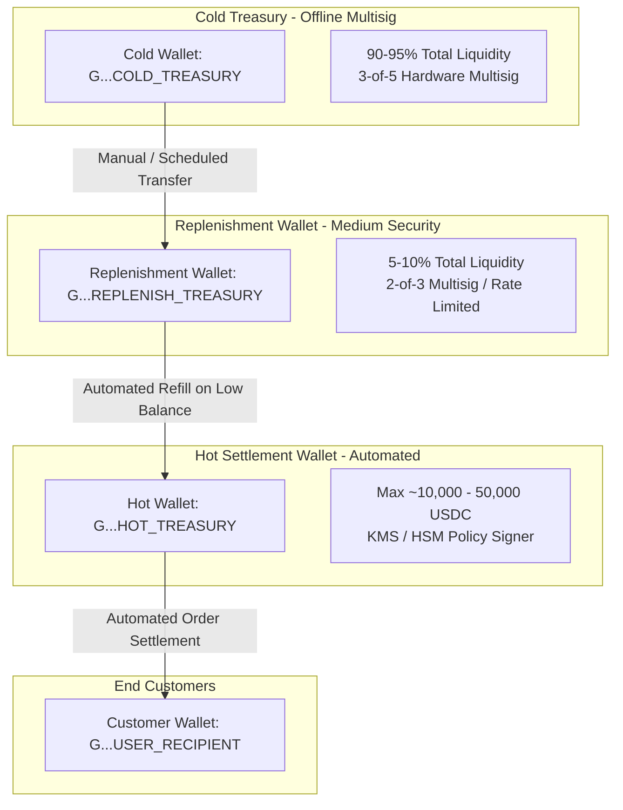

# MAINNET-04 — Treasury & Signing Architecture Specification

## Overview

This specification details the target production architecture for **LuminaRail** Treasury Management and Transaction Signing. 

The architecture guarantees:
1. **Zero Secret Storage**: Application servers and backend processes NEVER hold or store raw Stellar private keys or secret seeds.
2. **Abstracted Signer Interface**: Settlement business logic interacts exclusively with a clean `ITransactionSigner` interface, allowing seamless switching between local testnet signers, Cloud KMS (AWS/GCP), and institutional custody providers (Fireblocks).
3. **Decoupled Signing & Submission**: Transaction construction, policy authorization, signing, and network submission are isolated into distinct single-responsibility modules.
4. **Policy-Enforced Signing**: Transactions are validated by an independent Policy Engine (`ISettlementPolicyEngine`) against authoritative database records before signature generation.
5. **Durable Idempotency & Reconciliation**: Prevents double payment under any worker crash, network failure, or RPC timeout condition.

---

## 1. Signer Abstraction & Component Model

The architecture decouples settlement orchestration from physical key management.

```mermaid
graph TD
    A[SettlementWorker / SettlementService] -->|1. Request Settlement| B[TransactionBuilder]
    B -->|2. Construct Unsigned XDR| C[SettlementPolicyEngine]
    C -->|3. Validate Against DB State| D{Policy Approval?}
    D -- No -->|4a. Reject & Log Alert| E[AuditService / Security Alert]
    D -- Yes -->|4b. Approved XDR Request| F[ITransactionSigner Interface]
    F -->|Option A: Dev/Testnet| G[TestnetLocalSigner]
    F -->|Option B: AWS Production| H[AwsKmsSigner]
    F -->|Option C: Institutional| I[FireblocksCustodySigner]
    G -->|Sign XDR| J[Signed Transaction XDR]
    H -->|Sign XDR| J
    I -->|Sign XDR| J
    J -->|5. Hand off Signed XDR| K[StellarSubmitterService]
    K -->|6. Broadcast via RPC| L[Stellar / Soroban RPC]
```

### Module Interfaces

#### `ITransactionSigner`
```typescript
export interface SignerIdentity {
  publicKey: string;
  keyId: string;
  providerType: 'TESTNET_LOCAL' | 'AWS_KMS' | 'GCP_KMS' | 'FIREBLOCKS';
  networkPassphrase: string;
}

export interface AuthorizationPolicyContext {
  settlementId: string;
  orderId: string;
  expectedSource: string;
  expectedDestination: string;
  expectedAmountStroops: bigint;
  expectedAssetContract: string;
  expectedVaultContract: string;
}

export interface SignTransactionRequest {
  unsignedTransactionXdr: string;
  context: AuthorizationPolicyContext;
}

export interface SignTransactionResponse {
  signedTransactionXdr: string;
  transactionHash: string;
  signerPublicKey: string;
  signedAt: Date;
  auditMetadata: {
    signerId: string;
    algorithm: string;
    keyArn?: string;
  };
}

export interface ITransactionSigner {
  getIdentity(): Promise<SignerIdentity>;
  signTransaction(request: SignTransactionRequest): Promise<SignTransactionResponse>;
}
```

---

## 2. Separation of Signing & Submission

Transaction Signing and Network Submission are strictly separated to enforce the Principle of Least Privilege.



---

## 3. Transaction Authorization Policy Engine Specification

Before signing any transaction, `ISettlementPolicyEngine` enforces 9 mandatory security assertions:

```typescript
export interface ISettlementPolicyEngine {
  validateAndApprove(request: SignTransactionRequest): Promise<void>;
}
```

```
┌────────────────────────────────────────────────────────┐
│             Policy Validation Pipeline                 │
├────┬─────────────────────────────┬─────────────────────┤
│ Step│ Assertion                   │ Error Code          │
├────┼─────────────────────────────┼─────────────────────┤
│ 1  │ Network Passphrase matches   │ INVALID_NETWORK     │
│ 2  │ Target Contract == Vault ID │ UNAPPROVED_CONTRACT │
│ 3  │ Contract Function == create │ UNAPPROVED_FUNCTION │
│ 4  │ Source Address == Hot Wallet│ INVALID_SOURCE      │
│ 5  │ Dest Address == Order Wallet│ INVALID_DESTINATION │
│ 6  │ Asset Address == USDC ID    │ INVALID_ASSET       │
│ 7  │ Stroop Amount == Order Amount│ AMOUNT_MISMATCH     │
│ 8  │ Order Status == SETTLEMENT_PENDING │ INVALID_ORDER_STATE│
│ 9  │ Settlement Age < 24 Hours   │ STALE_SETTLEMENT    │
└────┴─────────────────────────────┴─────────────────────┘
```

If any check fails, execution aborts, signing is blocked, and an audit log (`SETTLEMENT_POLICY_VIOLATION`) is written.

---

## 4. Spending Limit Controls

The system enforces multi-layered spending controls to protect treasury capital:

```typescript
export interface SpendingLimitConfig {
  maxSingleSettlementUsdc: number; // e.g., 10,000 USDC
  maxHourlyOutflowUsdc: number;    // e.g., 50,000 USDC
  maxDailyOutflowUsdc: number;     // e.g., 200,000 USDC
  minSettlementUsdc: number;        // e.g., 1.00 USDC
  emergencyGlobalPause: boolean;   // e.g., false
  treasuryLowBalanceThreshold: number; // e.g., 5,000 USDC
}
```

---

## 5. Settlement State Machine & Durable Ledger Record

The `Settlement` entity serves as the authoritative execution record.



---

## 6. Chain & Database Reconciliation Architecture

A dedicated **Reconciliation Daemon** continuously scans settlements in `REQUIRES_RECONCILIATION` or `SUBMITTED` states to ensure DB and chain state parity:



---

## 7. Treasury Wallet Hierarchy & Hot/Cold Model



---

## 8. Multi-Tiered Emergency Circuit Breakers

```mermaid
graph LR
    Sub1[Security Alert / Incident] --> Step1{Select Emergency Action}
    Step1 -->|Level 1: Soft Pause| Act1[DB Config: EMERGENCY_GLOBAL_PAUSE = true]
    Step1 -->|Level 2: Policy Pause| Act2[Signer Policy: Cap MAX_DAILY_OUTFLOW to 0]
    Step1 -->|Level 3: On-Chain Pause| Act3[Soroban Contract: Call admin.pause()]

    Act1 --> Res1[Workers Stop Processing Settlements]
    Act2 --> Res2[KMS Signer Rejects All XDR Requests]
    Act3 --> Res3[Smart Contract Reverts All Transfers]
```

---

## 9. Testnet vs Production Environment Wiring

```typescript
export function resolveTransactionSigner(): ITransactionSigner {
  const provider = process.env.STELLAR_SIGNER_PROVIDER || 'testnet_local';

  if (process.env.NODE_ENV === 'production' && provider === 'testnet_local') {
    throw new Error('FATAL: Local testnet signer is forbidden in production environment.');
  }

  switch (provider) {
    case 'aws_kms':
      return new AwsKmsSigner({
        keyArn: process.env.AWS_KMS_KEY_ARN!,
        region: process.env.AWS_REGION || 'us-east-1',
      });

    case 'fireblocks':
      return new FireblocksCustodySigner({
        vaultAccountId: process.env.FIREBLOCKS_VAULT_ACCOUNT_ID!,
        apiKey: process.env.FIREBLOCKS_API_KEY!,
      });

    case 'testnet_local':
    default:
      return new TestnetLocalSigner({
        secretKey: process.env.STELLAR_SETTLEMENT_SIGNER_SECRET_KEY!,
        publicKey: process.env.STELLAR_SETTLEMENT_SIGNER_PUBLIC_KEY!,
      });
  }
}
```
