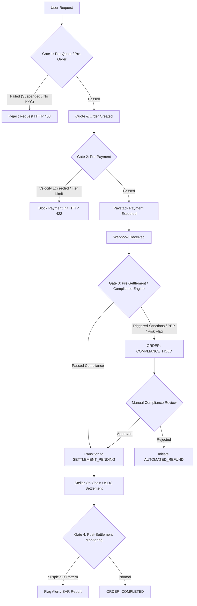

# MAINNET-05: Compliance Integration Boundary & Operational Control Architecture

> **Notice**: This document represents an audit of existing compliance and security controls in the LuminaRail backend repository as of commit `edb74b2`, and provides the technical design for inserting production KYC/AML/Sanctions verification boundaries and operational safety controls. No implementation or schema migrations have been performed in this phase.

---

## Executive Summary

LuminaRail facilitates cross-border fiat-to-stablecoin transfers (NGN payment via Paystack to Stellar mainnet USDC settlement). Operating at the intersection of traditional Nigerian banking rails and global public blockchain infrastructure exposes the platform to stringent regulatory frameworks (CBN guidelines, SEC Nigeria rules, FATF Travel Rule, OFAC sanctions, and global Anti-Money Laundering directives).

Currently, the LuminaRail backend enforces zero identity verification, KYC status checks, or sanctions screening. Any user with a valid JWT token can request quotes, create orders, initialize payments, and trigger USDC settlement to any arbitrary Stellar wallet address.

This document establishes the **Production Compliance Boundary Architecture**, defining exactly where and how compliance controls must plug into the existing pipeline across 4 enforcement gates, along with an **Operational Security Matrix** defining single vs. dual-control authorization for administrative and treasury operations.

---

## 1. Current Implementation vs. Identified Gaps

### 1.1 Current Implementation (Repository Baseline)
- **User Authentication**: JWT-based login returning `user.role` (`USER`, `ADMIN`, `SUPER_ADMIN`). User status (`ACTIVE`, `SUSPENDED`) is checked on authenticated endpoints (`src/middleware/auth.ts`).
- **Order Creation**: `orders.service.ts` validates quote validity/expiry, daily/monthly user limits (`MAX_DAILY_OUTFLOW_USDC`, `MAX_HOURLY_OUTFLOW_USDC`), and creates an `Order`.
- **Payment & Settlement**: Once payment succeeds via webhook, `settlements.service.ts` invokes `SettlementPolicyEngine` (checking global pause, treasury limits, wallet format, signer key) and executes the Soroban contract/Stellar transaction.
- **Compliance Controls**: **NONE**. No KYC tiering, identity verification, sanctions screening, PEP lists, FATF Travel Rule data collection, or suspicious activity monitoring exist.

### 1.2 Identified Compliance Gaps
1. **Unverified Recipient Wallets**: Settlement occurs to whatever `destinationAddress` is submitted during order creation without validating whether the wallet is sanctioned, belonging to a blocked jurisdiction, or bound to a verified identity.
2. **Missing KYC Tiering & Dynamic Limits**: Limits in `config/index.ts` are static and applied uniformly to all users regardless of verified identity level (Tier 1 vs. Tier 3).
3. **No Sanctions Screening (OFAC/PEP)**: Neither sender (Paystack customer email/name) nor recipient (Stellar wallet address) is screened against OFAC, EU, UN, or PEP sanctions databases.
4. **Lack of Compliance Hold / Review State**: Orders transition directly from `PAYMENT_CONFIRMED` -> `SETTLEMENT_PENDING` -> `COMPLETED`. There is no `COMPLIANCE_HOLD` or `PENDING_KYC` state to halt settlement for manual review or document submission.
5. **No FATF Travel Rule Compliance**: For settlements exceeding threshold limits (e.g., $1,000 USD / NGN equivalent), originator and beneficiary PII is not stored or transmitted in compliance with FATF Recommendation 16.

---

## 2. Production Compliance Decision Boundary Design

The execution pipeline MUST be governed by a strict 4-gate compliance enforcement architecture. Compliance verification is NOT a one-time check at user sign-up; it is evaluated dynamically across the complete transaction lifecycle.



---

## 3. Detailed Compliance Enforcement Gates

### Gate 1: Pre-Quote & Pre-Order Enforcement
* **Timing**: Executed inside `quotes.service.ts` and `orders.service.ts` prior to database record creation.
* **Required Checks**:
  1. **User Account Status**: Verify `User.status === ACTIVE` (block `SUSPENDED`, `PENDING_VERIFICATION`).
  2. **KYC Status Check**: Verify `User.kycTier >= REQUIRED_TIER` for requested transaction amount.
     * Tier 0 (Unverified): NGN 0 (Blocked from creating quotes/orders).
     * Tier 1 (BVN / NIN Verified): Max $500 / day.
     * Tier 2 (ID Document + Proof of Address): Max $5,000 / day.
     * Tier 3 (Enhanced Due Diligence / Corporate): Max $50,000 / day.
  3. **Sanctions Pre-Screening**: Fast local lookup of user email, phone, and name against local OFAC SDN index.
* **Action on Failure**: Return HTTP 403 Forbidden (`KYC_REQUIRED` or `ACCOUNT_RESTRICTED`).

### Gate 2: Pre-Payment Enforcement
* **Timing**: Executed inside `payments.service.ts` when customer clicks "Pay Now" / initializes Paystack transaction.
* **Required Checks**:
  1. **Cumulative Velocity Check**: Evaluate user's rolling 24-hour and 30-day aggregate settlement totals against tier limits.
  2. **Destination Wallet Sanctions & Risk Scoring**: Screen `destinationAddress` against chain analysis API (e.g., Chainalysis, Elliptic, TRM Labs) for risk tags (Darknet, Sanctions, Mixer, Scams).
  3. **FATF Travel Rule Data Collection**: If order amount $\ge \$1,000$, verify that originator PII (Full Name, DOB, Address, BVN) and beneficiary details are attached to the order context.
* **Action on Failure**: Block payment initialization. Cancel liquidity reservation (`RELEASED`). Update order to `CANCELLED`. Return HTTP 422 Unprocessable Entity.

### Gate 3: Pre-Settlement Enforcement (Critical Boundary)
* **Timing**: Executed asynchronously upon receipt of Paystack `charge.success` webhook, BEFORE setting `Order.status` to `SETTLEMENT_PENDING`.
* **Required Checks**:
  1. **Real-time Sanctions Screening (OFAC / UN / EU / PEP)**: Full fuzzy-name match on Paystack paying account name vs. target wallet address.
  2. **Payment Payer vs. Account Owner Matching**: Cross-reference Paystack account name / BVN with LuminaRail registered user name. (Prevents 3rd-party unverified deposits).
  3. **High-Risk Transaction Rules**: Check if payment matches suspicious patterns (e.g., 5th order in 10 minutes, rapid payment after registration).
* **Action on Failure**:
  * Set `Order.status = COMPLIANCE_HOLD`.
  * Set `Payment.status = SUCCEEDED`.
  * Create `ComplianceReview` audit record with flagged risk rules.
  * Emit high-priority Slack/PagerDuty alert to Compliance Officer dashboard.
  * **DO NOT** invoke `SettlementPolicyEngine` or submit Stellar transaction.

### Gate 4: Post-Settlement & Ongoing Monitoring
* **Timing**: Asynchronous background job post-settlement completion (`Order.status === COMPLETED`).
* **Required Checks**:
  1. **Transaction Monitoring (AML)**: Aggregate pattern analysis for structuring / smurfing detection.
  2. **Regulatory Reporting (SAR / STR)**: Automatic drafting of Suspicious Activity Reports for NFIU (Nigerian Financial Intelligence Unit) if transaction triggers AML threshold rules.
* **Action on Trigger**: Flag account for internal review; generate SAR file; optional automatic account suspension for severe hits.

---

## 4. Operational Security & Administrative Controls Matrix

To protect LuminaRail against internal fraud, unauthorized settlement overrides, and single-point-of-failure key abuse, administrative actions MUST adhere to strict separation of duties and dual-control approvals.

| Administrative Action | Single Admin Allowed? | Dual Approval Required? | Compliance Approval Required? | Automated System Execution? | Audit Trail Requirement |
| :--- | :---: | :---: | :---: | :---: | :--- |
| **View Order / Transaction History** | ✅ Yes | ❌ No | ❌ No | ❌ No | Logged in `AuditLog` |
| **Initiate Automated Refund (System Failure)** | ❌ No | ❌ No | ❌ No | ✅ Yes (Automated) | Full payment reference correlation |
| **Initiate Manual Customer Refund (< $1,000)** | ✅ Yes (Admin) | ❌ No | ❌ No | ❌ No | Reason code + admin ID logged |
| **Initiate Manual Customer Refund (≥ $1,000)** | ❌ No | ✅ Yes (2 Admins) | ❌ No | ❌ No | Dual signatures logged in `AuditLog` |
| **Release Compliance Hold (Approve Order)** | ❌ No | ❌ No | ✅ Yes (Compliance Officer) | ❌ No | Compliance review report attached |
| **Reject Compliance Hold (Trigger Refund)** | ❌ No | ❌ No | ✅ Yes (Compliance Officer) | ❌ No | STR/SAR reference logged |
| **Manual Settlement Retry (On-Chain Retry)** | ❌ No | ✅ Yes (2 Admins) | ❌ No | ❌ No | Cryptographic authorization hash |
| **Adjust Treasury Balance (Manual Ledger Entry)** | ❌ No | ✅ Yes (Super Admin + Finance) | ❌ No | ❌ No | Bank reference + dual admin IDs |
| **Activate Emergency Global Pause** | ✅ Yes (Any Admin) | ❌ No | ❌ No | ❌ No | Immediate incident alert emitted |
| **Deactivate Emergency Global Pause** | ❌ No | ✅ Yes (2 Super Admins) | ✅ Yes | ❌ No | Dual approval + safety checklist |
| **Rotate Signer Keys / Update Contract IDs** | ❌ No | ✅ Yes (2 Super Admins) | ❌ No | ❌ No | System maintenance audit record |

---

## 5. Compliance Review & Hold Lifecycle (Proposed State Additions)

To support compliance intervention without stranding funds or corrupting order state machines, the following state additions are required:

### Proposed OrderStatus Additions:
- `COMPLIANCE_HOLD`: Payment confirmed, but settlement halted pending compliance verification.
- `COMPLIANCE_REJECTED`: Settlement permanently blocked by compliance; order marked for mandatory refund.

### Proposed Audit Entity (`ComplianceReview`):
```prisma
model ComplianceReview {
  id              String           @id @default(uuid())
  orderId         String           @unique
  userAddress     String
  destinationAddr String
  riskScore       Float
  flaggedRules    String[]         // JSON array of triggered risk rule IDs
  status          ReviewStatus     // PENDING, APPROVED, REJECTED
  assignedTo      String?          // Compliance Officer User ID
  reviewerNotes   String?
  resolvedAt      DateTime?
  createdAt       DateTime         @default(now())
  updatedAt       DateTime         @updatedAt

  order           Order            @relation(fields: [orderId], references: [id])
}

enum ReviewStatus {
  PENDING
  APPROVED
  REJECTED
}
```

---

## 6. Summary of Compliance Integration Work (Deferred Implementation)

1. **Gate 1 & Gate 2 Middleware**: Integrate identity provider (e.g., Smile ID, YouVerify) for BVN/NIN verification and tier assignment.
2. **Chain Analysis API Integration**: Integrate Elliptic / Chainalysis API for destination wallet scoring during Gate 2 and Gate 3.
3. **Automated Sanctions Screening Service**: Connect fuzzy-search sanctions engine (OFAC / PEP / UN) into webhook handler before setting `SETTLEMENT_PENDING`.
4. **Compliance Admin Dashboard**: Build dual-control UI for Compliance Officers to inspect `COMPLIANCE_HOLD` orders, review risk score breakdowns, and approve/reject settlements.
