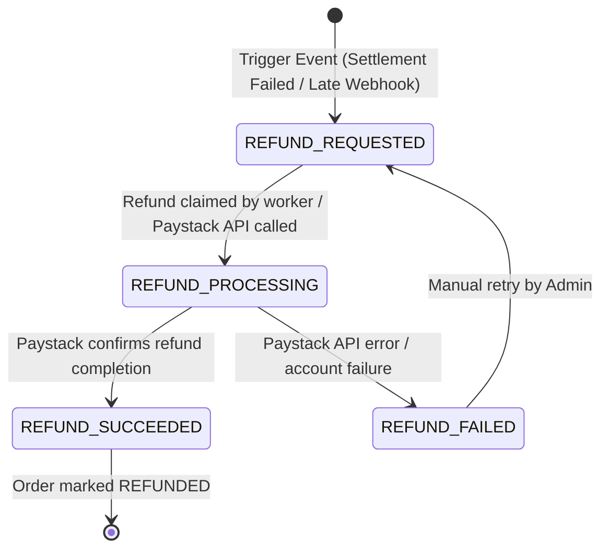

# MAINNET-05 — Refund Architecture & Paystack Reconciliation Specification

## Executive Summary

This specification defines the target production architecture for **Refund Management** and **Independent Paystack Reconciliation** in **LuminaRail**.

Currently, while `Prisma` schema contains enum values `OrderStatus.REFUNDED`, `PaymentStatus.REFUNDED`, and `PaymentType.REFUND`, the backend codebase contains **ZERO refund processing logic**, no `RefundService`, and no integration with Paystack's Refund API. If a customer's NGN deposit succeeds but USDC settlement fails on-chain, or if a webhook arrives after reservation expiry, the customer's fiat funds remain trapped in LuminaRail's Paystack account without automated recovery.

This document designs an enterprise-grade **Refund State Machine**, **Refund Service**, and **3-Way Reconciliation Daemon** to eliminate stranded customer capital.

---

## 1. Audit of Current Refund Capabilities

| Component | Current State | Deficit / Risk |
|---|---|---|
| **Prisma Enum `OrderStatus`** | Contains `REFUNDED` | No state transitions lead to `REFUNDED`. |
| **Prisma Enum `PaymentStatus`** | Contains `REFUNDED` | No code updates status to `REFUNDED`. |
| **Prisma Enum `PaymentType`** | Contains `REFUND` | No `Payment` record of type `REFUND` is ever created. |
| **Paystack Refund API Driver** | Not implemented | Paystack `/refund` API is never called. |
| **Refund Tracking Model** | Missing `Refund` table | System cannot track partial refunds, refund references, or refund failure reasons. |
| **Refund Idempotency** | Missing | Risk of double refunding a customer. |
| **Refund Authorization** | Missing | No admin approval workflow for manual refunds. |

---

## 2. Refund Lifecycle & Trigger Matrix

A refund MUST be initiated whenever customer fiat funds are collected but cryptocurrency settlement cannot be completed:

```
┌───────────────────────────────────────────────────────────────────────────────┐
│ REFUND TRIGGER 1: ON-CHAIN SETTLEMENT FAILURE                                 │
│ - Payment SUCCEEDED, but Soroban transaction failed / reverted on-chain.      │
│ - Action: Order transitions to REFUND_PENDING -> Auto-trigger NGN Refund.     │
├───────────────────────────────────────────────────────────────────────────────┤
│ REFUND TRIGGER 2: LATE WEBHOOK WITH EXPIRED LIQUIDITY RESERVATION            │
│ - Payment SUCCEEDED after 15-min reservation expired and pool balance empty.  │
│ - Action: Order transitions to REFUND_PENDING -> Auto-trigger NGN Refund.     │
├───────────────────────────────────────────────────────────────────────────────┤
│ REFUND TRIGGER 3: INVALID / MISSING RECIPIENT WALLET ADDRESS                  │
│ - Customer paid NGN, but provided invalid Ed25519 Stellar address.            │
│ - Action: Order transitions to REFUND_PENDING -> Auto-trigger NGN Refund.     │
├───────────────────────────────────────────────────────────────────────────────┤
│ REFUND TRIGGER 4: COMPLIANCE / SANCTIONS REJECTION                            │
│ - Customer or recipient wallet flagged by AML / Sanctions screening.          │
│ - Action: Order transitions to COMPLIANCE_HOLD / REFUND_PENDING -> Admin review.│
├───────────────────────────────────────────────────────────────────────────────┤
│ REFUND TRIGGER 5: DUPLICATE / OVERPAYMENT                                     │
│ - Customer sent multiple deposit transfers for single order reference.        │
│ - Action: Auto-create Refund record for duplicate payment amount.             │
├───────────────────────────────────────────────────────────────────────────────┤
│ REFUND TRIGGER 6: MANUAL ADMIN INITIATION                                     │
│ - Customer support / Risk team manually authorizes refund for customer.       │
│ - Action: Admin dashboard invokes Refund API with RBAC dual approval.         │
└───────────────────────────────────────────────────────────────────────────────┘
```

---

## 3. Recommended Refund State Machine Design



### Order & Payment Status Expansion
To support the refund lifecycle without ambiguity, the schema will be expanded in a future migration with the following dedicated refund states:

- `OrderStatus`: `REFUND_PENDING`, `REFUND_PROCESSING`, `REFUNDED`, `REFUND_FAILED`.
- `PaymentStatus`: `REFUND_PENDING`, `REFUND_PROCESSING`, `REFUNDED`, `REFUND_FAILED`.

---

## 4. Proposed `Refund` Data Model

To guarantee idempotency and auditability, a dedicated `Refund` entity is required:

```prisma
enum RefundStatus {
  REQUESTED
  PROCESSING
  SUCCEEDED
  FAILED
}

enum RefundReason {
  SETTLEMENT_FAILED
  RESERVATION_EXPIRED
  INVALID_WALLET_ADDRESS
  COMPLIANCE_REJECTED
  DUPLICATE_PAYMENT
  OVERPAYMENT
  MANUAL_ADMIN_INITIATED
}

model Refund {
  id                String       @id @default(uuid())
  refundReference   String       @unique @map("refund_reference") // Format: RFD_<timestamp>_<random>
  orderId           String       @map("order_id")
  paymentId         String       @map("payment_id")
  userId            String       @map("user_id")
  amount            Decimal      @db.Decimal(18, 4)
  currency          String       @default("NGN")
  reason            RefundReason
  status            RefundStatus @default(REQUESTED)
  provider          String       @default("PAYSTACK")
  providerRefundId  String?      @map("provider_refund_id")
  idempotencyKey    String?      @unique @map("idempotency_key")
  actorId           String?      @map("actor_id") // Admin ID if manually initiated
  lastError         String?      @map("last_error")
  processedAt       DateTime?    @map("processed_at")
  createdAt         DateTime     @default(now()) @map("created_at")
  updatedAt         DateTime     @updatedAt @map("updated_at")

  order             Order        @relation(fields: [orderId], references: [id])
  payment           Payment      @relation(fields: [paymentId], references: [id])
  user              User         @relation(fields: [userId], references: [id])

  @@index([status])
  @@index([orderId])
  @@map("refunds")
}
```

---

## 5. Paystack Refund API Integration Design

Paystack provides an explicit HTTP POST `/refund` endpoint:

### Request Payload (`POST https://api.paystack.co/refund`)
```json
{
  "transaction": "PAY_1725800000_abc123", // Payment reference or Paystack transaction ID
  "amount": 5000000,                      // Amount in kobo (50,000 NGN)
  "currency": "NGN",
  "customer_note": "LuminaRail refund for failed crypto settlement",
  "merchant_note": "Order ord_9988776655 settlement failed on-chain"
}
```

### Idempotent Refund Driver Interface (`IPaymentProvider`)
```typescript
export interface CreateRefundRequest {
  refundReference: string;
  paymentReference: string;
  amount: string;
  currency: string;
  reason: string;
}

export interface NormalizedRefundResponse {
  providerRefundId: string;
  status: 'PENDING' | 'SUCCEEDED' | 'FAILED';
  rawResponse?: Record<string, unknown>;
}
```

---

## 6. Independent 3-Way Paystack Reconciliation Architecture

LuminaRail MUST NOT rely 100% on incoming HTTP webhooks. Webhooks can be dropped, delayed by ISP outages, or blocked by firewall updates. 

A dedicated **Paystack Reconciliation Daemon** (`PaystackReconciliationDaemon`) will run every 5 minutes to perform 3-way ledger reconciliation:

```
┌───────────────────────────┐      ┌───────────────────────────┐      ┌───────────────────────────┐
│ 1. LuminaRail Database    │  vs  │ 2. Paystack API           │  vs  │ 3. Stellar Soroban RPC    │
│    (Payment & Order State)│      │    (Transaction Status)   │      │    (Ledger Finality)      │
└─────────────┬─────────────┘      └─────────────┬─────────────┘      └─────────────┬─────────────┘
              │                                  │                                  │
              └──────────────────────────────────┴──────────────────────────────────┘
                                                 │
                                                 ▼
                              ┌──────────────────────────────────┐
                              │  Reconciliation Engine Matrix   │
                              └──────────────────────────────────┘
```

### Discrepancy Resolution Matrix

| Discrepancy Scenario | Detection Method | Automated Recovery Workflow |
|---|---|---|
| **Scenario 1: Paystack PAID / LuminaRail UNPAID** | Paystack status `success`, LuminaRail Payment `CREATED`/`AWAITING_PAYMENT`. Missed webhook. | Daemon fetches transaction details via Paystack API `GET /transaction/verify/:ref`. Updates Payment $\rightarrow$ `SUCCEEDED`, confirms liquidity reservation, and advances Order $\rightarrow$ `SETTLEMENT_PENDING`. |
| **Scenario 2: LuminaRail PAID / Paystack UNPAID** | LuminaRail Payment `SUCCEEDED`, Paystack status `failed` / `abandoned`. Webhook spoofing or DB corruption. | Daemon flags **CRITICAL SECURITY ALERT**. Reverts Order $\rightarrow$ `FAILED`, revokes liquidity reservation, logs security incident (`PAYSTACK_DISCREPANCY_ALERT`). |
| **Scenario 3: Amount Mismatch** | Paystack `amount` differs from LuminaRail `Order.sourceAmount`. Underpayment or overpayment. | If Underpaid: Mark Payment `PARTIALLY_PAID`, hold settlement, notify user. If Overpaid: Process settlement for order amount, trigger auto-refund for excess. |
| **Scenario 4: Currency Mismatch** | Paystack `currency` != `Order.sourceCurrency`. | Flag `COMPLIANCE_HOLD`, block settlement, initiate full refund. |
| **Scenario 5: Unknown Payment Reference** | Deposit received on Paystack with reference missing from DB `payments` table. | Store in `UnlinkedPayment` quarantine table; raise operator alert. |
| **Scenario 6: Refund Mismatch** | Paystack refund status `processed`, LuminaRail `Refund` record `PROCESSING`. | Daemon marks `Refund` $\rightarrow$ `SUCCEEDED`, updates `Order` $\rightarrow$ `REFUNDED`. |

---

## 7. Operational Workflow for Manual Admin Refunds

When automated refunds fail or compliance requires manual dual-control review:

1. **Initiation**: Compliance Officer / Support Admin selects order in Admin Dashboard and clicks **Initiate Refund**.
2. **First Approval**: Admin 1 enters reason and submits refund request (`status: REQUESTED`).
3. **Second Approval (Dual Control)**: Admin 2 (Supervisor) reviews order history, Paystack deposit reference, and settlement error log, then clicks **Approve Refund**.
4. **Execution**: System invokes `RefundService.processRefund()`, calling Paystack Refund API and logging `REFUND_EXECUTED_BY_ADMIN` in `AuditLog`.
