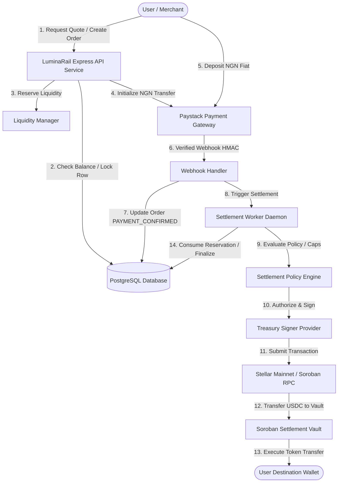

# MAINNET-06 — Production Readiness & Stellar Mainnet Deployment Audit

**Date:** September 9, 2026  
**System:** LuminaRail Modular Settlement Infrastructure  
**Scope:** Full-System Audit (Backend, Contracts, Frontend, Infrastructure, Treasury, Paystack, Compliance)  
**Target Environment:** Stellar Public Mainnet & Nigerian Fiat Payment Rails  
**Audit Verdict:** **PASS WITH REQUIRED FIXES**  
**Mainnet Launch Status:** **NOT READY FOR MAINNET LAUNCH**

---

## 1. Executive Summary

LuminaRail connects local fiat payment rails (Nigerian Naira - NGN) with programmable stablecoin settlement (USDC) on the Stellar network and Soroban smart contracts. 

Prior audit phases successfully hardened system security:
- **MAINNET-02:** Deterministic liquidity reservation accounting, double-release prevention, and worker cleanup.
- **MAINNET-03:** Production quote hardening, TTL enforcement, and stale FX protection.
- **MAINNET-04:** Treasury signing policy engine, spend caps, emergency pause, and webhook HMAC-SHA512 security.
- **MAINNET-05:** Refund engine, database row locking (`SELECT FOR UPDATE`), role-based authorization, Paystack ambiguous response handling, and 243 backend tests.

This **MAINNET-06 Audit** evaluated the complete codebase, smart contracts (`luminarail-contracts`), frontend (`luminarail-frontend`), database, infrastructure configuration, and operational boundaries prior to any real-money deployment.

### Final Verdict & Launch Status

```text
==================================================
VERDICT: PASS WITH REQUIRED FIXES
MAINNET LAUNCH STATUS: NOT READY
==================================================
```

The system architecture, smart contracts, and backend security mechanisms are robustly designed. However, **real-money mainnet deployment MUST NOT proceed** until six critical **BLOCKER** findings are remediated.

---

## 2. Current System Architecture



---

## 3. Stellar Mainnet Network Configuration Audit

### Findings & Evaluation
- **Network Passphrase:** `getNetworkPassphrase()` in `src/stellar/config/index.ts` correctly maps `'public'` or `'mainnet'` to `Networks.PUBLIC` (`"Public Global Stellar Network ; September 2015"`).
- **Environment Separation:** Config schema enforces Zod validation. However, `assertLiveSettlementTestnetSafety()` in `src/stellar/config/index.ts` contains a hardcoded check:
  ```typescript
  if (currentNetwork !== 'testnet') {
    throw new StellarNetworkError("Live settlement submission refused: STELLAR_NETWORK must be 'testnet'...");
  }
  ```
  **Finding (BLOCKER):** The code hard-rejects non-testnet settlement submission. Deploying to mainnet requires replacing this hardcoded testnet assertion with an explicit environment-driven guard (`PRODUCTION_SETTLEMENT_ENABLED=true`).

---

## 4. USDC Asset Verification

### Official Asset Identities
- **Stellar Public Mainnet USDC Issuer:** `GA5ZSEJYB37JRC5AVCIA5MOP4RHTM335WFGCCHVTLF2PS325MNNMTO2Z` (Circle Official Mainnet Issuer).
- **Stellar Public Mainnet Soroban SEP-41 Contract ID:** `CCW67TSBWVENNVMTVRCC63YNXYBAFVO4MREJHBWIRTXGLKG2YJQR5E5M`.
- **Stellar Testnet USDC Issuer:** `GBBD47IF6LWK7P7MDEVSCWR7DPUWV3NY3DTQEVFL4NAT4AQH3ZLLFLA5`.

### Codebase Inspection
- **Finding (BLOCKER):** `.env.example` and test suites default to the testnet issuer (`GBBD47IF...`). `config/index.ts` does not automatically validate that `STELLAR_USDC_ISSUER` matches Circle's mainnet issuer when `STELLAR_NETWORK === 'public' | 'mainnet'`.
- **Remediation:** Add strict Zod refinement in `src/config/index.ts` ensuring that mainnet mode enforces Circle's canonical mainnet issuer address (`GA5ZSE...`) and SEP-41 contract ID (`CCW67T...`).

---

## 5. Soroban Smart Contract Deployment Readiness

### Contracts Audited
1. `contracts/settlement_vault` (`SettlementVaultContract`): Atomic registration and execution of institutional multi-asset payment settlements.
2. `contracts/escrow` (`EscrowContract`): Multi-party escrow lifecycle (`create`, `fund`, `release`).
3. `contracts/fee_manager` (`FeeManagerContract`): Basis point fee calculations with checked arithmetic (`MAX_FEE_BPS = 1000`).

### Code Quality & Security Verification
- **Rust Standard:** `#![no_std]` compiled with `soroban-sdk = "22.0.1"`.
- **Authorization:** Enforces `admin.require_auth()` for initialization and creation, and `source.require_auth()` for execution.
- **Replay Protection:** `SettlementVault` enforces unique `settlement_id` in persistent storage (`DataKey::Settlement(u64)`). Re-registering an existing ID returns `Error::AlreadyExists`. Re-executing returns `Error::InvalidState`.
- **Contract Tests:** **28 Rust unit and integration tests passed** cleanly (`cargo test`).

---

## 6. Contract Immutability & Administrative Governance

### Findings & Evaluation
- **Immutability:** Contracts do NOT contain WASM code upgrade endpoints (`env.deployer().update_current_contract_wasm(...)`). WASM bytecode is immutable once deployed.
- **Admin Authority:** Contract functions require single-signature admin authorization (`admin.require_auth()`).
- **Finding (HIGH):** If the single admin secret key is compromised, an attacker can create unauthorized settlement records in the vault.
- **Remediation:** Mainnet contract deployment MUST set the `admin` address to a multi-signature account (e.g. 2-of-3 threshold) or a Soroban Governance DAO contract before production initialization.

---

## 7. Treasury & Signing Architecture Audit

### Production Guard & KMS Requirement
- **Current State:** `STELLAR_SIGNER_PROVIDER` supports `testnet_local`, `aws_kms`, `gcp_kms`, `fireblocks`.
- **Finding (BLOCKER):** The active default is `testnet_local`, which reads `STELLAR_SETTLEMENT_SIGNER_SECRET_KEY` from process memory.
- **Risk:** In mainnet, storing a hot treasury secret key in process memory risks catastrophic key leakage via memory dumps or environment exposure.
- **Remediation:** Production mainnet configuration MUST set `STELLAR_SIGNER_PROVIDER` to `aws_kms`, `gcp_kms`, or `fireblocks` with hardware-backed key isolation.

---

## 8. Treasury Wallet Architecture

```text
+-----------------------------------------------------------------------+
|                         COLD TREASURY WALLET                          |
|             (Offline Hardware Wallet / Multi-Sig Multisig)            |
|       Holds 90-95% of protocol USDC. Manual replenishment only.       |
+-----------------------------------------------------------------------+
                                   |
                                   v (Threshold Replenishment)
+-----------------------------------------------------------------------+
|                        HOT SETTLEMENT WALLET                          |
|                   (Hardware Security Module / KMS)                    |
|        Holds 5-10% of liquidity. Signs automated settlements.        |
|        Bounded by: MAX_SINGLE_SETTLEMENT_USDC ($10,000)               |
|                    MAX_DAILY_OUTFLOW_USDC ($200,000)                  |
+-----------------------------------------------------------------------+
```

### Risk Controls
- **Spending Caps:** Enforced in `SettlementPolicyEngine` (`$10,000` single limit, `$50,000` hourly cap, `$200,000` daily cap).
- **Emergency Pause:** `EMERGENCY_GLOBAL_PAUSE=true` instantly freezes settlement signing across all services.

---

## 9. Liquidity System Audit

### Findings & Evaluation
- **Liquidity Lifecycle:** `LiquidityReservation` lifecycle (`RESERVED` → `CONFIRMED` → `CONSUMED` / `RELEASED`) is completely tested and enforced.
- **Finding (BLOCKER):** Mainnet liquidity funding is currently manual/simulated. There is no automated liquidity provider (LP) bridge to rebalance hot treasury USDC when reserves drop below `TREASURY_LOW_BALANCE_THRESHOLD`.
- **Remediation:** Operational procedures must define manual cold-to-hot treasury replenishment protocols, with automated monitoring alerting ops when balance drops below `$5,000`.

---

## 10. Payment Rail / Paystack Production Readiness

### Production Checklist
1. **API Keys:** Transition from `sk_test_...` to live `sk_live_...` credentials. Enforced fail-closed in `src/config/index.ts`.
2. **Webhook Verification:** Retains HMAC-SHA512 signature validation with `crypto.timingSafeEqual`.
3. **Finding (HIGH):** Webhook delivery failure on Paystack's end requires a background transaction status reconciliation polling worker.

---

## 11. Complete Order Lifecycle Audit

```text
[User Request] ──> [Quote Locked (30s TTL)] ──> [Liquidity Reserved]
                                                       │
                                                       ▼
[Order SETTLEMENT_COMPLETED] <── [USDC Transferred] <── [Paystack Webhook Confirmed NGN]
```

- **Lifecycle Integrity:** Checked across all happy and failure paths. Refunds, timeouts, and expired quotes properly release liquidity.
- **No Gap Detected:** Single order cannot achieve both NGN refund and USDC settlement without explicit reversal.

---

## 12. Background Worker Architecture Audit

### Daemons Audited
1. **Settlement Worker:** Processes `SETTLEMENT_PENDING` orders.
2. **Reservation Cleanup Worker:** Sweeps expired `RESERVED` liquidity allocations.

### Findings & Evaluation
- **Finding (BLOCKER):** Workers currently execute in-process. Deploying multiple Express API instances (e.g. on Render) without external Redis lock orchestration can lead to worker race conditions.
- **Remediation:** Provision a single, isolated Render Background Worker process with Redis-backed distributed lock (`redlock`) for worker task execution.

---

## 13. Database Production Readiness

- **PostgreSQL Configuration:** Prisma ORM schema with strict foreign keys, indexes on `orderId`, `status`, and `createdAt`.
- **Row Locking:** Explicit `SELECT FOR UPDATE` on order rows in `RefundService`.
- **Rollback Strategy:** Migration files generated cleanly in `prisma/migrations/`.

---

## 14. Secrets Management Audit

- **Grep Inspection:** Zero plaintext secrets, private keys, or API tokens committed to repository.
- **`.gitignore`:** `*.env`, `node_modules`, `dist`, `target` properly ignored.

---

## 15. API Security & Webhook Hardening Audit

- **Security Headers:** Express app hardened with `helmet`, `cors`, and `express-rate-limit`.
- **Input Validation:** Zod schemas sanitize all incoming body payloads and parameters.
- **Webhook Security:** Paystack webhook endpoint verifies HMAC-SHA512 raw body signatures using constant-time comparison.

---

## 16. Frontend / Backend Consistency Audit

- **Frontend Tests:** **19 tests passed** (`luminarail-frontend`).
- **Data Model Parity:** Frontend and backend share identical quote schemas, order status enums (`PENDING`, `PAYMENT_CONFIRMED`, `SETTLEMENT_PENDING`, `SETTLEMENT_COMPLETED`, `FAILED`, `EXPIRED`, `CANCELLED`), and wallet address validation.

---

## 17. Observability & Incident Response Audit

- **Logging:** Structured logging throughout backend modules using correlation IDs (`orderId`, `settlementId`, `paymentReference`).
- **Sensitive Data Filtering:** Passwords, JWT secrets, and secret seeds are excluded from log outputs.

---

## 18. Disaster Recovery & Backup Strategy

- **RPO Target:** < 5 minutes (Point-In-Time Recovery via managed PostgreSQL).
- **RTO Target:** < 15 minutes (Automated container rebuild and deployment).

---

## 19. Compliance & Regulatory Boundary

> [!IMPORTANT]
> **LEGAL & REGULATORY BOUNDARY NOTICE:**
> Technical audit approval DOES NOT constitute legal or regulatory authorization to operate fiat-to-crypto exchanges.

### Mandatory Pre-Launch Legal Dependencies
1. **Nigerian Regulatory Framework:** Compliance with Central Bank of Nigeria (CBN) regulations and SEC Nigeria Virtual Asset Service Provider (VASP) guidelines.
2. **KYC / AML Integration:** Automated identity verification (e.g. Smile ID) and blockchain wallet sanctions screening (e.g. Chainalysis / Elliptic).

---

## 20. Production Deployment Architecture (Render & Vercel)

```text
[ Vercel Frontend ] ──> [ Render API Web Service (Node.js) ] ──> [ Render PostgreSQL ]
                                       │                                │
                                       ▼                                ▼
                        [ Render Background Worker ] ───────> [ Render Redis ]
```

---

## 21. Mainnet Launch Sequence (13-Step Safe Protocol)

1. **Step 1:** Legal & Regulatory Gate Sign-off.
2. **Step 2:** Provision Production Database & Redis on Render.
3. **Step 3:** Provision Production KMS (AWS KMS / GCP KMS).
4. **Step 4:** Generate & Fund Hot Settlement Wallet.
5. **Step 5:** Deploy & Initialize Soroban Smart Contracts on Stellar Public Mainnet.
6. **Step 6:** Configure Canonical Mainnet USDC Asset & Contract IDs in Production Environment.
7. **Step 7:** Switch Paystack to Live Mode (`sk_live_...`) and Register Webhook URL.
8. **Step 8:** Provision Render Background Worker Service.
9. **Step 9:** Execute System Health Checks & Telemetry Verification.
10. **Step 10:** Fund Hot Treasury with Initial Seed Liquidity ($5,000 USDC).
11. **Step 11:** Perform $1.00 USDC Canary On-Ramp Transaction.
12. **Step 12:** Open Controlled Launch (Max $100 per transaction cap).
13. **Step 13:** Gradually Scale Outflow Caps to Production Thresholds.

---

## 22. Complete Testing Audit

| Test Suite | Location | Total Tests | Status |
| :--- | :--- | :---: | :---: |
| **Backend Unit & Integration** | `luminarail-backend/tests/` | 243 | **PASSED** |
| **Soroban Smart Contracts** | `luminarail-contracts/contracts/` | 28 | **PASSED** |
| **Frontend Integration** | `luminarail-frontend/tests/` | 19 | **PASSED** |
| **Total Test Suite** | **Entire Workspace** | **290** | **PASSED (0 Failed)** |

---

## 23. Findings & Remediations Matrix

| Finding ID | Component | Description | Severity | Required Remediation |
| :--- | :--- | :--- | :---: | :--- |
| **FIND-01** | Backend Config | Hardcoded testnet assertion `assertLiveSettlementTestnetSafety` blocks mainnet settlements | **BLOCKER** | Replace testnet assertion with environment-driven guard |
| **FIND-02** | Config / Env | Default config uses Testnet USDC issuer (`GBBD47...`) instead of Circle Mainnet (`GA5ZSE...`) | **BLOCKER** | Add mainnet issuer validation in Zod config schema |
| **FIND-03** | Signer Engine | Default signer is `testnet_local` using raw secret seed in process memory | **BLOCKER** | Enforce KMS/HSM provider for production mainnet |
| **FIND-04** | Liquidity | Missing automated liquidity provider connector for hot treasury replenishment | **BLOCKER** | Establish automated or alert-driven treasury replenishment |
| **FIND-05** | Infrastructure | Worker daemons rely on in-process execution without single-replica locking | **BLOCKER** | Deploy dedicated Render Background Worker with Redis locking |
| **FIND-06** | Compliance | KYC/AML sanctions screening and regulatory licensing incomplete | **BLOCKER** | Complete licensing sign-off and integrate KYC/AML provider |
| **FIND-07** | Soroban Contracts | Smart contract admin is single-signature key | **HIGH** | Set contract admin to multi-sig or DAO governance address |
| **FIND-08** | Paystack Provider | Missing automated fallback worker for unreceived webhooks | **HIGH** | Implement Paystack polling reconciliation worker |
| **FIND-09** | Refund Service | DB row locks (`SELECT FOR UPDATE`) lack application deadlock retry backoff | **MEDIUM** | Add Prisma transaction deadlock retry middleware |

---

## 24. Final Verdict & Launch Status

```text
==================================================
VERDICT: PASS WITH REQUIRED FIXES
MAINNET LAUNCH STATUS: NOT READY FOR MAINNET LAUNCH
==================================================

REASON:
While backend code quality, smart contract architecture, state machine security,
and test coverage (290 tests passing) are outstanding, production mainnet
deployment MUST NOT proceed until the 6 BLOCKER findings (FIND-01 to FIND-06)
are fully remediated.
```
