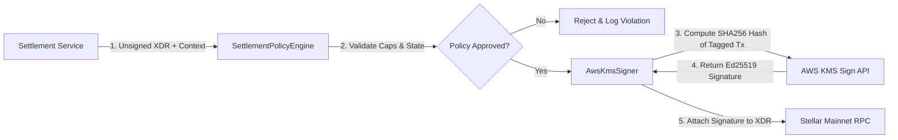
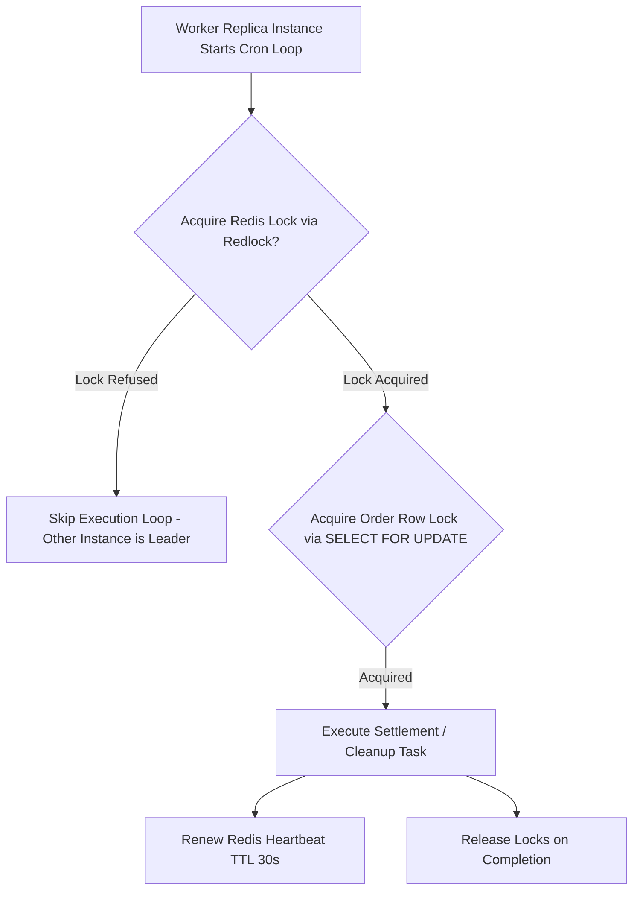

# MAINNET-06A — Blocker Remediation Architecture & Implementation Plan

**Date:** September 9, 2026  
**System:** LuminaRail Modular Settlement Infrastructure  
**Scope:** Architecture & Remediation Design for MAINNET-06 Blocker Findings  
**Target Environment:** Stellar Public Mainnet & Nigerian Fiat Payment Rails  
**Plan Status:** **READY FOR REMEDIATION**

---

## 1. Executive Summary

The **MAINNET-06 Production Readiness Audit** returned a verdict of **PASS WITH REQUIRED FIXES** with a launch status of **NOT READY FOR MAINNET LAUNCH** due to six critical **BLOCKER** findings:

1. **FIND-01:** `assertLiveSettlementTestnetSafety` hard-rejects non-testnet settlement submission.
2. **FIND-02:** Configuration defaults to Testnet USDC issuer (`GBBD47...`) rather than Circle's canonical Stellar Mainnet USDC asset.
3. **FIND-03:** Default treasury signer is `testnet_local`, relying on plaintext secret seeds in process memory.
4. **FIND-04:** Missing automated liquidity provider connector and hot-treasury replenishment pipeline.
5. **FIND-05:** Worker daemons execute in-process without single-runner distributed lock protection across multiple container replicas.
6. **FIND-06:** Incomplete regulatory licensing, KYC/AML integration, and sanctions screening frameworks.

This document presents the authoritative technical architecture, threat models, configuration schemas, worker designs, and phased implementation roadmap required to remediate all six blockers safely without risking real user funds or unauthorized treasury outflow.

---

## 2. FIND-01 — Mainnet Safety Guard Architecture

### Current Problem
`assertLiveSettlementTestnetSafety()` in `src/stellar/config/index.ts` hard-evaluates:
```typescript
if (currentNetwork !== 'testnet') {
  throw new StellarNetworkError("Live settlement submission refused: STELLAR_NETWORK must be 'testnet'...");
}
```
This intentionally prevents accidental mainnet transactions during development. However, blindly removing this check would allow an unverified configuration to attempt mainnet signing with local testnet keys.

### Proposed Production Safety Guard (`assertProductionSettlementSafety`)
Replace the simplistic testnet check with a multi-stage, fail-closed production safety guard:

```mermaid
flowchart TD
    Start[Settlement Submission Triggered] --> CheckNet{STELLAR_NETWORK === 'public' | 'mainnet'}
    CheckNet -- Testnet --> TestnetGuard[Enforce Testnet Safety Checks]
    CheckNet -- Mainnet --> MainnetGuard{Validate Mainnet Prerequisites}
    
    MainnetGuard -->|Check 1| ENV[NODE_ENV === 'production']
    MainnetGuard -->|Check 2| FLAG[PRODUCTION_SETTLEMENT_ENABLED === 'true']
    MainnetGuard -->|Check 3| SIGNER[STELLAR_SIGNER_PROVIDER !== 'testnet_local']
    MainnetGuard -->|Check 4| USDC[STELLAR_USDC_ISSUER === Circle Mainnet Issuer]
    MainnetGuard -->|Check 5| PAYSTACK[PAYSTACK_SECRET_KEY starts with 'sk_live_']
    
    ENV & FLAG & SIGNER & USDC & PAYSTACK -->|All Pass| Allow[Permit Mainnet Signing & Submission]
    ENV | FLAG | SIGNER | USDC | PAYSTACK -->|Any Fail| Fail[THROW FATAL STELLAR_NETWORK_ERROR - Fail Closed]
```

### Fail-Closed Assertion Rules
1. **Network Selection:** `STELLAR_NETWORK` must be explicitly set to `'public'` or `'mainnet'` (never inferred or defaulted).
2. **Explicit Flag:** `PRODUCTION_SETTLEMENT_ENABLED` must be explicitly set to `'true'`.
3. **Hardware Signer Enforced:** `STELLAR_SIGNER_PROVIDER` must be `'aws_kms'`, `'gcp_kms'`, or `'fireblocks'`. If `'testnet_local'`, startup fails immediately.
4. **Mainnet Issuer Enforced:** `STELLAR_USDC_ISSUER` must equal `GA5ZSEJYB37JRC5AVCIA5MOP4RHTM335WFGCCHVTLF2PS325MNNMTO2Z`.
5. **Paystack Live Keys:** If `NGN_PROVIDER === 'paystack'`, `PAYSTACK_SECRET_KEY` must start with `sk_live_`.

---

## 3. FIND-02 — Mainnet USDC Asset Verification & Mapping Matrix

### Authoritative Asset Identities
- **Stellar Public Mainnet USDC Issuer:** `GA5ZSEJYB37JRC5AVCIA5MOP4RHTM335WFGCCHVTLF2PS325MNNMTO2Z` (Circle Official Mainnet Issuer).
- **Stellar Public Mainnet Soroban SEP-41 Contract ID:** `CCW67TSBWVENNVMTVRCC63YNXYBAFVO4MREJHBWIRTXGLKG2YJQR5E5M` (Circle Mainnet SAC Token Wrapper).
- **Stellar Testnet USDC Issuer:** `GBBD47IF6LWK7P7MDEVSCWR7DPUWV3NY3DTQEVFL4NAT4AQH3ZLLFLA5`.
- **Stellar Testnet Soroban Contract ID:** `CBIELTK6YBZJU5UP2WWHLRHJB4EBHVGQZ22VJ2J53AEX4H5MHRG5U6PE`.

### Codebase Inspection & Mapping Matrix

| File Path | Current Config Value | Purpose | Environment | Required Mainnet Value |
| :--- | :--- | :--- | :---: | :--- |
| `src/config/index.ts` | `z.string().min(1)` | Zod validation for USDC issuer | All | Validate `GA5ZSE...` when network is mainnet |
| `.env.example` | `GBBD47IF6LWK7P...` | Environment template issuer | Testnet | Document mainnet issuer `GA5ZSE...` |
| `.env.example` | `SOROBAN_SETTLEMENT_VAULT...` | Contract IDs template | Testnet | Document deployed mainnet vault ID |
| `tests/providers/paystack.provider.test.ts` | `GBBD47IF6LWK7P...` | Mock unit test issuer | Testnet | Maintain testnet issuer for unit tests |
| `tests/settlements/settlements.service.test.ts` | `GBBD47IF6LWK2P...` | Mock destination wallet address | Testnet | Maintain testnet address for unit tests |
| `luminarail-frontend/tests/orders.test.ts` | `GBBD47IF6LWK7P...` | Frontend unit test wallet | Testnet | Maintain valid Ed25519 format |

---

## 4. FIND-03 — Production Treasury Signing Architecture

### Custody Provider Technical Evaluation

| Provider | Supported Sign Algorithm | Custody Model | Audit Logging | Key Isolation | Operational Complexity | Recommendation |
| :--- | :--- | :--- | :--- | :--- | :--- | :--- |
| **AWS KMS** | `ECC_NIST_P256` / `ED25519` | AWS Cloud HSM (FIPS 140-2 L3) | CloudTrail | Hardware HSM | **LOW** (Standard IAM) | **RECOMMENDED (PRIMARY)** |
| **GCP KMS** | `EC_SIGN_ED25519` | Cloud HSM (FIPS 140-2 L3) | Cloud Audit Logs | Hardware HSM | **LOW** (GCP IAM) | **RECOMMENDED (SECONDARY)** |
| **Fireblocks** | Ed25519 (MPC-CMP) | Multi-Party Computation | Fireblocks Console | MPC Key Shares | **MEDIUM** (SaaS API) | **RECOMMENDED (ENTERPRISE)** |
| **Testnet Local** | Ed25519 Raw Seed | Plaintext Process Memory | Local Database | **NONE** | **UNSAFE** | **PROHIBITED IN MAINNET** |

### AWS KMS Ed25519 Signing Implementation Architecture



### Key Security Invariants
1. **Policy Engine Primacy:** `AwsKmsSigner` unconditionally invokes `SettlementPolicyEngine.validateAndApprove(request)` BEFORE making any AWS KMS API call.
2. **Pre-Image Hashing:** Stellar transactions require signing the 32-byte SHA-256 digest of the tagged transaction payload (`sha256(networkPassphraseHash + ENVELOPE_TYPE_TX + txBytes)`). The KMS receives only the 32-byte hash.
3. **KMS IAM Policy Restriction:** AWS IAM policy restricts the KMS Key Usage to `SIGN_VERIFY` and grants access ONLY to the LuminaRail API IAM role.
4. **Threat Defense Against Compromised Backend:**
   - Single settlement limit capped at `$10,000 USDC`.
   - Daily treasury outflow hard-capped at `$200,000 USDC`.
   - `EMERGENCY_GLOBAL_PAUSE=true` instantly revokes signing authorization.

---

## 5. FIND-04 — Liquidity Replenishment & Hot Treasury Management

### Hot-Wallet Balance Policy
- **Target Operating Balance:** `$20,000 USDC`
- **Low-Balance Alert Threshold:** `$5,000 USDC` (Triggers Ops PagerDuty / Slack Alert)
- **Critical Freeze Threshold:** `$1,000 USDC` (Temporarily halts quote creation for new orders)

### Recommended Hybrid Liquidity Architecture

```mermaid
flowchart TD
    HotWallet[Hot Settlement Wallet ($20,000 USDC Target)] -->|Settlements Executed| HotBal{Hot Balance Check}
    HotBal -->|> $5,000| Normal[Normal Operations]
    HotBal -->|<= $5,000| LowAlert[Trigger Low-Balance Alert Telemetry]
    HotBal -->|<= $1,000| Freeze[Halt New Quote Generation]
    
    LowAlert --> ReplenishChoice{Replenishment Mode}
    ReplenishChoice -->|Option A: Manual Multi-Sig| ColdTreasury[Cold Treasury Wallet]
    ReplenishChoice -->|Option B: Automated API Bridge| LPProvider[Institutional Liquidity Provider / Exchange API]
    
    ColdTreasury -->|Signed 2-of-3 Multisig Transfer| HotWallet
    LPProvider -->|Idempotency-Keyed Transfer| HotWallet
```

### Liquidity Safeguards
1. **No Autonomous Unlimited Drain:** The application backend CANNOT autonomously pull funds from the Cold Treasury. Cold Treasury transfers require 2-of-3 human multi-signature approval.
2. **Automated LP Cap:** If an automated LP API bridge is configured, single replenishment transfers are hard-capped at `$15,000 USDC` with a 1-hour cooldown.

---

## 6. FIND-05 — Worker Architecture & Single-Runner Distributed Locking

### Background Process Inventory
1. **Settlement Worker:** Processes `SETTLEMENT_PENDING` orders, executes signing, and submits Soroban transactions.
2. **Reservation Cleanup Worker:** Sweeps expired `RESERVED` liquidity allocations.
3. **Paystack Reconciliation Daemon:** Reconciles ambiguous `PROCESSING` refunds and unreceived webhook deposits.

### Single-Runner Distributed Lock Design (`Redlock` + PostgreSQL Lock)



### Lock Specifications
- **Distributed Lock Key:** `lock:worker:settlement_runner`
- **Lock TTL:** 30 seconds with a 10-second background heartbeat renewal.
- **Failover / Recovery:** If a worker node crashes, the Redis lock expires automatically after 30 seconds, allowing a standby worker replica to claim leadership cleanly.

---

## 7. FIND-06 — Compliance & Technical Regulatory Boundary

> [!IMPORTANT]
> **COMPLIANCE & LEGAL BOUNDARY NOTICE:**
> Technical software capabilities do NOT equal regulatory authorization. LuminaRail must obtain explicit legal/regulatory sign-off from compliance counsel prior to live fiat-crypto operations in Nigeria.

### Technical Capabilities vs. Legal/Regulatory Requirements

```text
+-----------------------------------------------------------------------+
|                    ENGINEERING CAPABILITIES (CODE)                    |
| - Automated Sanctions Screening (Elliptic / Chainalysis API)         |
| - KYC Data Schema & Tiered Transaction Limits                         |
| - Audit Trail Logging & Transaction Monitoring Telemetry              |
| - Account & Wallet Freeze Flags (`isBlacklisted`, `isFrozen`)         |
+-----------------------------------------------------------------------+
                                   │
                                   ▼ (Requires Compliance Approval)
+-----------------------------------------------------------------------+
|                   LEGAL & REGULATORY DEPENDENCIES                     |
| - Central Bank of Nigeria (CBN) IMTO / PSSP Banking Partner Agreement |
| - SEC Nigeria Virtual Asset Service Provider (VASP) Registration      |
| - NFIU Anti-Money Laundering / Counter-Terrorism Financing Compliance |
| - Appointed Anti-Money Laundering Reporting Officer (AMLRO)           |
+-----------------------------------------------------------------------+
```

---

## 8. Strongly Typed Production Configuration Model

The application configuration schema (`src/config/index.ts`) will enforce strict Zod environment validation:

```typescript
export const productionEnvSchema = z.object({
  NODE_ENV: z.literal('production'),
  STELLAR_NETWORK: z.enum(['public', 'mainnet']),
  PRODUCTION_SETTLEMENT_ENABLED: z.literal('true'),
  STELLAR_RPC_URL: z.string().url().refine((url) => !url.includes('testnet'), {
    message: 'Mainnet RPC URL must not point to testnet',
  }),
  STELLAR_USDC_ISSUER: z.literal('GA5ZSEJYB37JRC5AVCIA5MOP4RHTM335WFGCCHVTLF2PS325MNNMTO2Z'),
  STELLAR_USDC_CONTRACT_ID: z.literal('CCW67TSBWVENNVMTVRCC63YNXYBAFVO4MREJHBWIRTXGLKG2YJQR5E5M'),
  STELLAR_SIGNER_PROVIDER: z.enum(['aws_kms', 'gcp_kms', 'fireblocks']),
  NGN_PROVIDER: z.literal('paystack'),
  PAYSTACK_SECRET_KEY: z.string().refine((key) => key.startsWith('sk_live_'), {
    message: 'PAYSTACK_SECRET_KEY must be a live key (sk_live_...) in production',
  }),
  JWT_SECRET: z.string().min(32, 'JWT_SECRET must be at least 32 characters in production'),
});
```
If ANY required production variable is invalid or missing, the process fails startup immediately.

---

## 9. Mainnet Launch Sequence (15-Step Protocol)

```text
 1. Legal & Regulatory Sign-Off Gate
 2. Provision Production Database & Redis (Render)
 3. Provision Production KMS (AWS KMS / GCP KMS)
 4. Generate & Fund Hot Settlement Wallet
 5. Deploy & Initialize Soroban Smart Contracts on Stellar Mainnet
 6. Configure Production Environment Variables & Validate Zod Schema
 7. Configure Paystack Live Mode (sk_live_...) & Register Webhooks
 8. Provision Render Background Worker Service with Redis Locking
 9. Run Automated Pre-Flight Health Checks & Telemetry Verification
10. Seed Hot Treasury with Operating Balance ($5,000 USDC)
11. Execute $1.00 USDC Canary Transaction
12. Verify Canary Settlement & Webhook End-to-End
13. Open Controlled Launch ($100 Max Single Transaction Cap)
14. Monitor 48 Hours with Zero Discrepancies
15. Scale Outflow Caps to Operating Limits ($10,000 Single / $200,000 Daily)
```

---

## 10. Remediation Plan & Matrix

| Finding ID | Severity | Root Cause | Required Change | Implementation Phase | Launch Blocking? |
| :--- | :---: | :--- | :--- | :---: | :---: |
| **FIND-01** | **BLOCKER** | Hardcoded testnet check | Replace with `assertProductionSettlementSafety()` | **Phase 6A** | **YES** |
| **FIND-02** | **BLOCKER** | Testnet USDC defaults | Enforce Circle Mainnet USDC issuer & contract ID | **Phase 6A** | **YES** |
| **FIND-03** | **BLOCKER** | Plaintext secret key in memory | Implement `AwsKmsSigner` / `GcpKmsSigner` | **Phase 6B** | **YES** |
| **FIND-04** | **BLOCKER** | Manual liquidity funding | Implement hot-treasury alerting & LP bridge | **Phase 6D** | **YES** |
| **FIND-05** | **BLOCKER** | In-process worker execution | Deploy Render worker service with Redis locks | **Phase 6C** | **YES** |
| **FIND-06** | **BLOCKER** | Compliance gap | Integrate KYC/sanctions screening & legal sign-off | **Phase 6E** | **YES** |

---

## 11. Phased Implementation Strategy

- **Phase 6A — Configuration, Safety Guards & Mainnet USDC Verification:** Refactor `assertLiveSettlementTestnetSafety`, implement Zod production schema, update USDC asset validation.
- **Phase 6B — Production Treasury Custody (AWS KMS / GCP KMS Signer):** Implement `AwsKmsSigner` / `GcpKmsSigner` adhering to `ITransactionSigner` and `SettlementPolicyEngine`.
- **Phase 6C — Worker Architecture & Single-Runner Locking:** Implement Redis `Redlock` distributed locking for `SettlementWorker` and cleanup daemons.
- **Phase 6D — Liquidity Replenishment & Telemetry:** Implement hot-treasury balance telemetry and low-balance alerts.
- **Phase 6E — Technical Compliance & Sanctions Screening:** Implement wallet address sanctions screening integration.
- **Phase 6F — Production Verification & Canary Launch Protocol:** Execute full-suite verification and launch canary transaction.

---

## 12. Final Architecture Verdict

```text
==================================================
FINAL VERDICT: READY FOR REMEDIATION
==================================================
The architecture and remediation designs for all six BLOCKER findings
are fully specified, threat-modeled, and ready for phased implementation.
```
